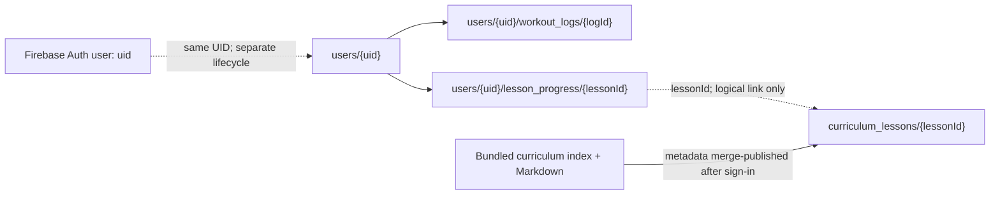

# Firestore schema at a glance

Local source contract, not a live database inventory or deployment/approval claim. The [blueprint](../firebase-blueprint.json) is declarative documentation: Firestore does **not** automatically enforce it. Client access is governed by [firestore.rules](../firestore.rules); serializers define the app's write payloads.

| Context | Current value |
|---|---|
| Project | `gen-lang-client-0444088676` (task-provided; not checked live) |
| Named database | `ai-studio-android-physiapp-429fc4fa-f1c5-40b6-ae8f-cc5e0f3a237a`, from [firebase.json](../firebase.json) |
| Android database selection | `FirebaseFirestore.getInstance(R.string.firestore_database_id)` via the resolved string resource |
| Enforcement | Rules validate client writes; no automatic blueprint validation, foreign keys, or cascading deletes |

## Paths and relationships

`uid` below is the Firebase Auth UID (named `userId` in rules and Kotlin). IDs must remain stable across profile updates, content edits and retries; retain existing bundled lesson IDs rather than deriving IDs from mutable titles.

| Document path | Payload / identity | Current client access |
|---|---|---|
| `users/{uid}` | `UserProfile`; `userId == uid` | Owner read/create/update; delete denied |
| `users/{uid}/workout_logs/{logId}` | `WorkoutLogDoc`; `userId == uid`, `logId == document ID` | Owner read/create/update/delete |
| `users/{uid}/lesson_progress/{lessonId}` | `LessonProgressDoc`; `userId == uid`, `lessonId == document ID` | Owner read/create/update/delete |
| `curriculum_lessons/{lessonId}` | `CurriculumLessonDoc`; `lessonId == document ID` | Any signed-in user read/create/update; delete denied |

Rules do not require the parent profile or referenced curriculum lesson to exist. No separate chapter/subchapter collections are declared; their metadata is repeated in lesson documents. Unmatched paths are denied to clients.

## `users/{uid}` fields

Bounds below describe **current rules**, not additional policy. Numeric ranges are inclusive; string bounds are rule string sizes. Required fields are validated on the resulting document, including merge writes.

| Field | Native type | Required | Rule constraint / Kotlin behavior |
|---|---|---|---|
| `userId` | String | Yes | Equals path UID; repository replaces supplied value with signed-in UID |
| `email` | String | Yes | Length 1–200; no email syntax or Auth-email equality check |
| `displayName` | String | Yes | Length 1–100 |
| `photoUrl` | String | No | Length 0–1000; nullable Kotlin value omitted when null |
| `trainingGoal` | String | Yes | Length 1–100; default `Strength & Hypertrophy`, not an enum |
| `fitnessLevel` | String | Yes | `Beginner`, `Intermediate`, `Advanced`; default `Intermediate` |
| `weeklyTargetWorkouts` | Integer (Kotlin `Long`) | Yes | 1–7; default 4; policy minimum is 2, see gaps below |
| `favoriteSplit` | String | Yes | Length 1–100; default `Upper / Lower (4-Day Hypertrophy)` |
| `weightKg` | Number (Kotlin `Double`) | No | 20–300; nullable Kotlin value omitted when null |
| `heightCm` | Number (Kotlin `Double`) | No | 50–260; nullable Kotlin value omitted when null |
| `createdAt` | Timestamp | Yes | Supplied value or server timestamp fallback; must be ≤ request time |
| `updatedAt` | Timestamp | Yes | Server timestamp on every profile write; must be ≤ request time |

`saveUserProfile()` uses `SetOptions.merge()`. Omitting a null optional value does **not** clear an existing stored value. Explicit stored null is not allowed for these optional fields by current rules.

## `curriculum_lessons/{lessonId}` fields

All 12 fields below are required by current validation and emitted by `CurriculumLessonDoc.toMap()`.

| Field | Native type | Current rule constraint / meaning |
|---|---|---|
| `lessonId` | String | Equals document ID; existing bundled lesson ID |
| `title` | String | Length 1–200 |
| `chapterId` | String | Length 1–100; logical chapter slug |
| `chapterNumber` | Integer (Kotlin `Long`) | 1–20 |
| `chapterTitle` | String | Length 1–150 |
| `subchapterId` | String | Length 1–100; logical subchapter slug |
| `subchapterTitle` | String | Length 1–150 |
| `lessonIndex` | Integer (Kotlin `Long`) | 1–50; position within subchapter |
| `durationMinutes` | Integer (Kotlin `Long`) | 1–120 |
| `category` | String | Length 1–50; Kotlin writes `TopicCategory.name`, rules do not enforce an enum |
| `summary` | String | Length 1–1000 |
| `assetPath` | String | Length 1–300; relative bundled Markdown path, not a URL; existence not validated |

Kotlin category names: `MOVEMENT_PATTERNS`, `ANATOMY_PHYSIOLOGY`, `BIOMECHANICS`, `LOAD_AND_RECOVERY`, `PROGRAMMING_COACHING`. These are app values, not an exhaustive rules restriction.

Content is loaded from `app/src/main/assets/curriculum/curriculum_index.json` and bundled Markdown. In `PhysiAppMain`, `LaunchedEffect(user.uid)` calls `syncLessonsToFirestore()` after authentication, merge-publishing metadata at stable lesson IDs. This is a client-side write attempt, not a verified publishing service or proof of successful remote writes. Different app bundle versions can overwrite shared metadata; merge publication does not remove stale documents or extra fields.

`keyTerms` and `isGateMilestone` exist in `CurriculumLessonDoc` and are supplied during sync, but **are omitted by `toMap()`**; they are not part of the current published payload or blueprint. Full lesson text, questions, practical application and optional readings are bundled content, not fields in this Firestore payload. Rules do not restrict extra field names, so omission does not prove such fields are absent from remote documents.

## User subcollections

| Payload | Fields and current rules |
|---|---|
| Workout log | Required: `logId` = path ID, `userId` = UID; `workoutName` string length 1–150; `splitDay` string length 1–100; integer `durationMinutes` 0–360; integer `completedExercisesCount` and `totalExercisesCount` each 0–50; Timestamp `completedAt` and `createdAt` ≤ request time. Optional `notes`: string length 0–1000, omitted when null. No completed-count ≤ total-count check. |
| Lesson progress | Required: `lessonId` = path ID, `userId` = UID, Timestamp `completedAt` ≤ request time. Records completion only; no knowledge-check score or server-validated gate transition. |

Workout writes use `set()` without merge, retaining a supplied `logId` or generating `log_<currentTimeMillis>` when blank. Reusing an ID replaces that document; generating a new ID on a retry can create another log. Lesson completion uses merge at the lesson ID, avoiding multiple documents for the same lesson, but refreshes `completedAt` on every save. Learning completion and training logs remain separate signals.

## Timestamps, access and deletion

- **Native vs portable:** Kotlin uses `com.google.firebase.Timestamp`; null timestamps become `FieldValue.serverTimestamp()` write sentinels, resolved by Firestore. The blueprint retains JSON `string` / `date-time` for portability and marks all timestamp properties with `x-firestore-type: "timestamp"`. Do not write date-time strings directly to timestamp fields: client rules require native timestamps ≤ request time.
- **Admin bypass:** Privileged Admin SDK/server access bypasses Firestore Security Rules and is controlled through IAM. Owner-only access and denied deletes above describe client rules, not restrictions on administrators; privileged writes need their own validation.
- **Deletion is not recursive:** Deleting `users/{uid}` through privileged access does not delete `workout_logs` or `lesson_progress`. Current client rules deny profile deletion but allow owner deletion of individual child documents. Cleanup requires an explicit authorized process.
- **Auth is separate:** Deleting a Firestore profile does not delete the Auth account; deleting the Auth account does not cascade through Firestore data. This contract does not establish an implemented account-erasure workflow.

## Known gaps — recorded, not fixed here

| Gap | Current effect |
|---|---|
| Signed-in curriculum writes | Any authenticated user can create/update valid shared lesson metadata; there is no publisher/admin role check. |
| Weekly minimum mismatch | Rules permit 1; [PD-001 / PD-003](product-decisions.md) require a minimum of 2. Blueprint reflects the existing rules, not a policy change. |
| Timestamp immutability absent | Rules check type and upper time bound only; they do not preserve original `createdAt` or `completedAt`, require server-generated values, or enforce monotonic updates. |

No rules, Kotlin implementation, security posture or product policy is changed by this documentation update.

## Future feature fields — proposed, not deployed

Possible additions such as timezone/week-boundary preferences, separate learning/training streak state, gate/check results, content bundle version/provenance/approval evidence, or offline-sync idempotency keys are **not current serializer/blueprint contracts**. Each requires a scoped design, policy/privacy review and implementation evidence. No schema entry itself confers content, legal or publication approval.

## Source references

- Models: [UserProfile.kt](../app/src/main/java/com/example/physiapp/data/model/UserProfile.kt), [CurriculumModels.kt](../app/src/main/java/com/example/physiapp/data/model/CurriculumModels.kt), [WorkoutLogDoc.kt](../app/src/main/java/com/example/physiapp/data/model/WorkoutLogDoc.kt).
- Writes/reads: [UserProfileRepository.kt](../app/src/main/java/com/example/physiapp/data/repository/UserProfileRepository.kt), [CurriculumRepository.kt](../app/src/main/java/com/example/physiapp/data/repository/CurriculumRepository.kt), [PhysiAppMain.kt](../app/src/main/java/com/example/physiapp/ui/PhysiAppMain.kt).
- Authority: [rules](../firestore.rules), [Firebase configuration](../firebase.json), [product decisions](product-decisions.md). Sources inspected locally; no live Firebase access performed.