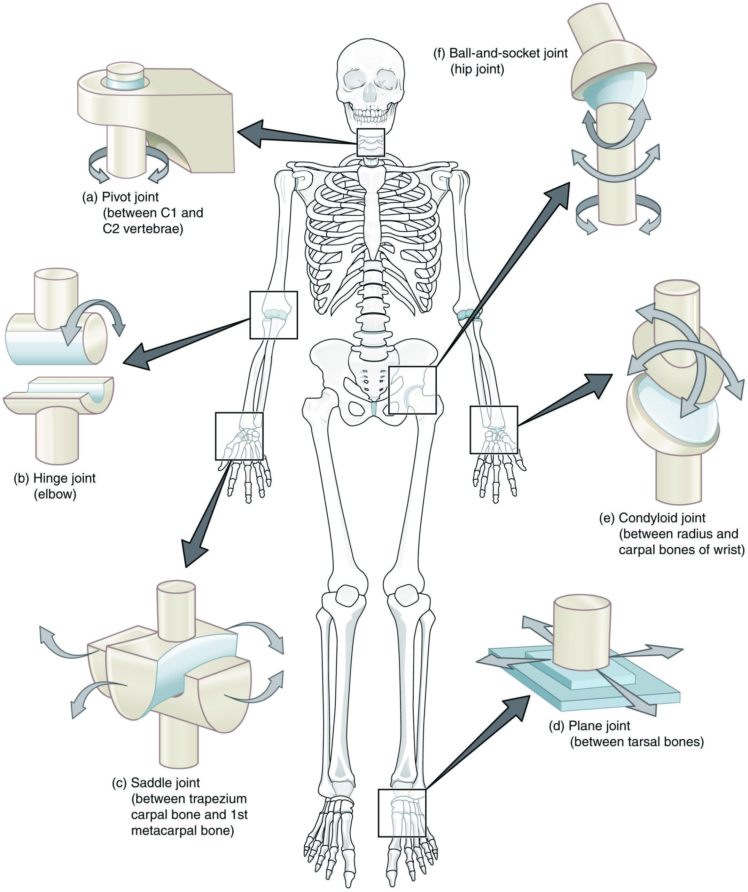

# Joint Classification and Synovial Joints

Not all joints move the same way. In basic anatomy, joints can be grouped by their structure or by how much movement they allow. Some joints are largely immovable, some allow only a small amount of movement, and some allow substantial movement. For exercise and human movement, synovial joints are especially important because they support many of the large, visible motions we train and analyze.

Synovial joints have a joint capsule (an enclosing sleeve), synovial fluid (a lubricating liquid), and articular cartilage (smooth tissue covering the bone ends) that help the joint move. Shoulders, hips, knees, elbows, and ankles are common examples. These joints do not all move the same way, but they share the basic role of allowing controlled movement while managing load.

## Two Ways to Classify a Joint
Structural classification asks what connects the bones. Fibrous joints use fibrous connective tissue; cartilaginous joints connect bones through cartilage; synovial joints have a joint cavity. Functional classification instead asks how much movement is available. These systems answer different questions, so “synovial” names a structure rather than simply meaning “moves a lot.” Skull sutures illustrate very limited movement, while connections between vertebral bodies allow small movements that contribute to larger trunk motion.

At a synovial joint, articular cartilage covers the contacting bone surfaces. The capsule encloses the joint, and its inner synovial membrane (the capsule's lining) produces synovial fluid that contributes to lubrication. Ligaments help guide and constrain motion, while muscles acting across the joint contribute active control. The joint is therefore more than two hard surfaces sliding freely: its motion depends on both the arrangement of tissues and the forces acting through them.

## Shape Suggests Possibilities
A hinge joint emphasizes flexion and extension, as at the elbow. A pivot joint permits rotation, as at the proximal connection between the radius and ulna in the forearm. Ball-and-socket joints, such as the shoulder and hip, permit motion in several directions. A plane joint has flatter surfaces that glide; a condyloid joint has an oval surface that allows bending and side-to-side motion; a saddle joint has opposing curved surfaces that permit motion in two main directions, as at the base of the thumb. These names summarize movement possibilities rather than every anatomical detail.

Source: OpenStax, *Biomechanics of Human Movement*, Fig. 3, section 2.2.2, printed p. 69 (PDF p. 81); CC BY 4.0.

The knee is often introduced as a modified hinge because flexion and extension dominate, but it also has smaller movements that depend on position. The shoulder's broad movement possibilities do not mean that every direction is equally available under every load. A classification is a useful starting model, not a complete account of a living joint.

## Why It Matters
If the learner understands that different joints are built for different kinds of movement, exercise technique becomes easier to reason about. This helps explain why the shoulder moves more freely than the knee and why joint structure affects exercise choice.

## Worked Example: Reaching Versus Stepping
Imagine reaching diagonally toward a shelf and then stepping onto a low platform. The reach can combine shoulder flexion, abduction, and rotation, with elbow motion and shoulder-blade movement also contributing. The step involves hip motion in several directions, but knee flexion and extension are more prominent than large sideways knee movement.

The explanation is not that one joint is “better.” Different structures support different movement roles. A reasonable exercise description names the major actions each joint permits and acknowledges contributions from adjacent joints. Trying to make the knee copy all the shoulder's visible freedoms would confuse their structural differences rather than improve the description.

## Misconceptions and Limits
Synovial fluid does not replace muscular control, and a joint capsule is not a muscle. Likewise, a large visible range does not prove greater strength or better exercise quality. Two people with the same joint class may use different ranges because their proportions, task setup, and control differ. This overview explains movement possibilities; it does not identify individual tissue conditions or prescribe a single ideal position for everyone.

## Key Terms
- joint classification
- immovable joint
- slightly movable joint
- synovial joint
- joint capsule
- synovial fluid
- articular surface

## Knowledge Check
1. Which type of joint is most important for visible exercise movement?
   - A. Synovial joint
   - B. Immovable joint
   - C. Fixed skull joint
   - D. None of the above

2. Why are synovial joints important?
   - A. They allow controlled movement while handling load
   - B. They eliminate the need for muscles
   - C. They are only relevant in injury rehab
   - D. They are the same as tendons

3. What should a learner understand about joint classification?
   - A. Every joint in the body is designed for the same amount of motion
   - B. Different joints allow different movement possibilities and constraints
   - C. Joint structure is unrelated to exercise choice
   - D. Synovial joints only matter in elite sport

## Apply It
Compare the shoulder and the knee. Ask: "Which one is built for more freedom of motion, and how does that change the way exercise is performed?"

## Read More (Optional)
[Read A&P sections 9.1–9.4, “Classification of Joints” through “Synovial Joints”](../../optional-readings/joint-03-optional.md). Read PDF pages 340–347 (printed 324–331), beginning at “Classification of Joints” and ending after the opening synovial-joint overview; skip the later joint-specific examples. Allow about 15–20 minutes. As you read, separate how a joint is classified from what a person happens to do with it.
